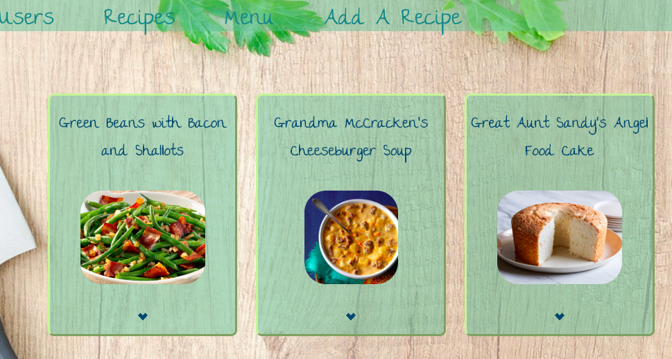

# README

<h1>Meal Planner</h1>

Take those wonderful handwritten recipes from friends and family and store them on this web application. Then in the menu planner you can take those recipes and put them in your menu planner. 

<h1>Built With </h1>
Ruby on Rails for the backend
Javascript for the front end

<h1>Getting Started</h1>

1. After cloning down the repository,type `cd mealPlannerBackEnd` into the terminal This will get you into the Back-End 
of the project which is built with Ruby on Rails. 
2. Enter 'rails db:create' to create the database
3. Enter `rails db:migrate` into the terminal to create the tables needed for this web application. 
4.  Enter `bundle install` into the terminal to make sure all necessary gems for running the web application 
are installed.
5. Enter `rails s` into the terminal to start the server for the Back-End. This will allow the Front-End to access the data in the tables. 
6. You will now need to get into the Front-End by typing 'cd ..' then `cd mealPlannerFrontEnd` into the terminal. 
7. Enter `lite-server` to start the front end. Your browser should come up with the home page. 

https://mealplannerwebapp-dbbd7.firebaseapp.com/recipe.html

